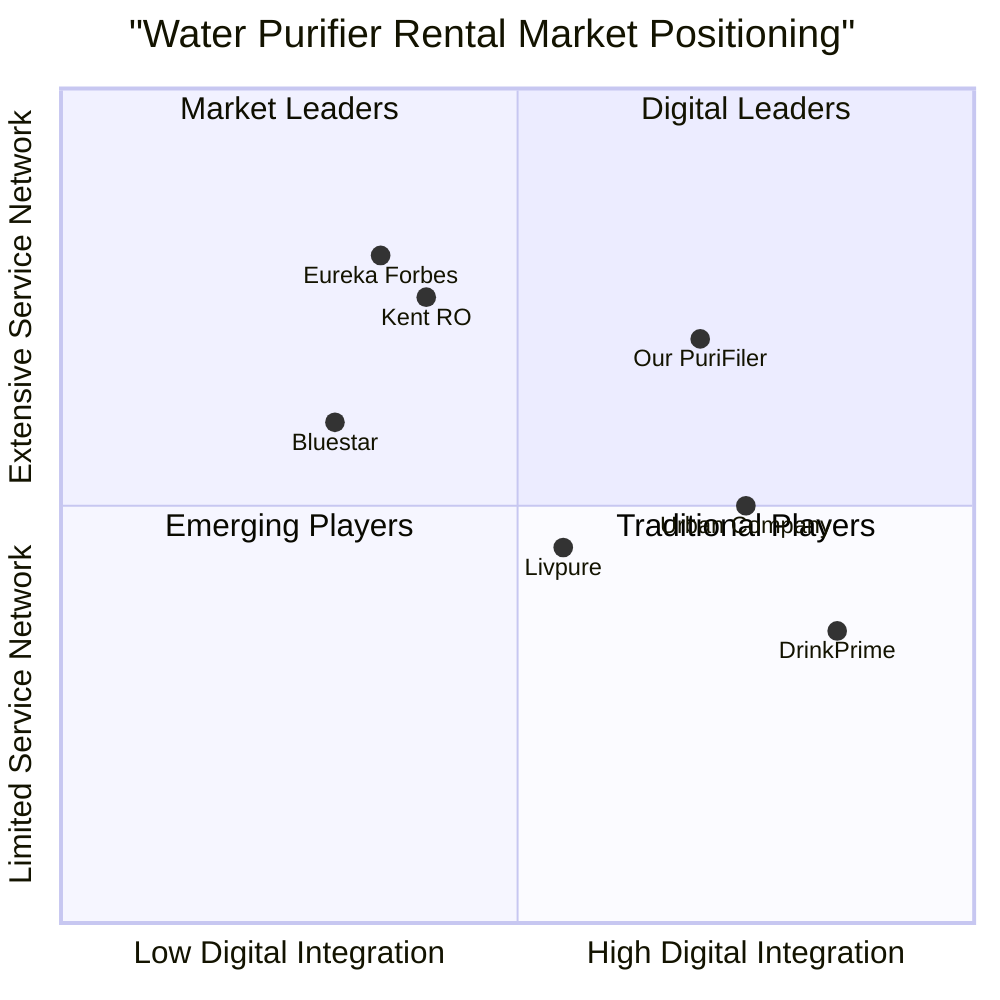

# Product Requirements Document: PuriFiler Management System

## Original Requirements

Create a water purifier rental/sales management system with multiple stakeholders: customers, admins, franchise owners, and service agents. Key requirements include:

- User authentication with phone OTP via Firebase
- Customer profiles with personal details and location coordinates
- Product catalog with images, descriptions, features, rental rates, and sales prices
- Payment processing with Razorpay
- Service request assignment and tracking
- Franchise area management with polygon mapping
- Role-based access control
- Notifications (email, SMS, WhatsApp, push)

## Product Goals

1. **Streamlined Distribution Management**: Create a comprehensive system for managing water purifier sales, rentals, and services across multiple franchise areas.

2. **Enhanced Customer Experience**: Provide customers with an easy-to-use platform for purchasing or renting purifiers, scheduling maintenance, and resolving issues.

3. **Operational Efficiency**: Optimize franchise operations through automated assignments, geographic mapping, and multi-channel notifications.

## User Stories

### As a Customer
1. **As a customer**, I want to browse available purifiers with detailed specifications so that I can select the one that best meets my needs.
2. **As a customer**, I want to easily rent or purchase a purifier with flexible payment options so that I can choose the financial arrangement that works best for me.
3. **As a customer**, I want to request service or maintenance with minimal effort so that my purifier remains in optimal condition.
4. **As a customer**, I want to manage my rental agreement, including pausing service when needed, so that I have control over my subscription.

### As an Admin
1. **As an admin**, I want to manage franchise areas using geographic mapping so that service territories are clearly defined.
2. **As an admin**, I want to oversee all operations across multiple franchises so that I can ensure quality standards are met.
3. **As an admin**, I want to manage product catalogs and pricing so that offerings remain current and competitive.

### As a Franchise Owner
1. **As a franchise owner**, I want to manage service agents in my territory so that customer requests are handled promptly.
2. **As a franchise owner**, I want to view performance metrics for my franchise area so that I can optimize operations.
3. **As a franchise owner**, I want to handle customer service requests within my territory so that customer satisfaction remains high.

### As a Service Agent
1. **As a service agent**, I want to receive and accept installation or service requests so that I can efficiently plan my work schedule.
2. **As a service agent**, I want to update the status of service requests so that all stakeholders stay informed.
3. **As a service agent**, I want to access customer and product information so that I can provide appropriate service.

## Competitive Analysis

### Kent RO
**Pros:**
- Established brand with high customer trust
- Wide range of purifier technologies
- Strong service network

**Cons:**
- Limited rental options
- Higher price points
- Traditional service booking system

### Livpure
**Pros:**
- Innovative subscription models
- Competitive pricing
- Good product variety

**Cons:**
- Smaller service network
- Limited technology integrations
- Less brand recognition

### Eureka Forbes
**Pros:**
- Legacy brand with high recognition
- Extensive service network
- Comprehensive product range

**Cons:**
- Traditional sales approach
- Limited digital integration
- Higher maintenance costs

### Bluestar
**Pros:**
- High-quality purification technology
- Strong corporate clientele
- Reliable service

**Cons:**
- Limited rental offerings
- Higher price point
- Less focus on consumer segment

### Urban Company (Service Provider)
**Pros:**
- On-demand service model
- Digital-first approach
- Variety of service options

**Cons:**
- No product ownership
- Inconsistent service quality
- Limited geographic coverage

### DrinkPrime
**Pros:**
- Pure subscription model
- IoT integration
- Transparent pricing

**Cons:**
- Limited product range
- Restricted geographic presence
- Less customization options

## Competitive Quadrant Chart

## Technical Specifications

### Requirements Analysis

The PuriFiler Management System requires a comprehensive technical solution that addresses multiple stakeholder needs. The system must handle authentication, customer management, product catalog, payment processing, service request management, franchise area mapping, and notifications across various channels.

Key technical components include:

1. **Authentication System**: Firebase for phone OTP authentication
2. **Backend Framework**: Fastify with structured organization (controllers, models, services, routes)
3. **Database**: Turso DB with Drizzle ORM
4. **Storage**: S3 for image storage
5. **Payment Integration**: Razorpay for processing payments
6. **Mapping**: Geographic polygon mapping for franchise areas
7. **Notifications**: Email, SMS, WhatsApp, and push notification integration
8. **Documentation**: Swagger for API documentation
9. **RBAC**: Role-based access control for different user types

### Requirements Pool

#### P0 (Must-Have)

**Authentication & User Management**
1. Phone OTP-based authentication using Firebase
2. User registration with basic details (name, address, contact)
3. Location capture via frontend map coordinates
4. Role-based user management (customer, admin, franchise owner, service agent)

**Product Management**
1. Product catalog with images, descriptions, and specifications
2. Pricing information (rental rates and purchase prices)
3. Product feature display with key attributes
4. Image management with S3 integration

**Order & Payment Processing**
1. Rental and purchase workflows
2. Razorpay payment integration
3. Order status tracking
4. Deposit and monthly payment handling for rentals

**Service Management**
1. Service request creation and tracking
2. Service agent assignment system
3. Service status updates
4. Installation request management

**Franchise Management**
1. Franchise area definition with polygon mapping
2. Service agent to franchise area mapping
3. Customer to franchise area mapping
4. Basic franchise performance dashboards

**Notifications**
1. Service request notifications
2. Assignment notifications
3. Status update notifications
4. Payment reminders and confirmations

#### P1 (Should-Have)

**User Management**
1. User profile customization
2. Alternative contact management
3. Address verification system
4. User activity history

**Product Management**
1. Product comparison feature
2. Stock availability tracking
3. Product recommendations
4. Seasonal promotions system

**Rental Management**
1. Rental pause functionality
2. Rental extension options
3. Upgrade paths for existing rentals
4. Rental-to-purchase conversion

**Service Management**
1. Scheduled maintenance reminders
2. Service history tracking
3. Parts replacement tracking
4. Service agent performance metrics

**Franchise Management**
1. Territory performance analysis
2. Customer density mapping
3. Service efficiency reporting
4. Franchise-level inventory management

**Notifications**
1. Multi-channel notification preferences
2. Scheduled notification campaigns
3. Maintenance reminders
4. Feedback request notifications

#### P2 (Nice-to-Have)

**User Experience**
1. Customer loyalty program
2. Referral system
3. Customer feedback collection and analysis
4. Usage pattern insights

**Product Enhancements**
1. IoT integration for filter status monitoring
2. Water quality tracking
3. Consumption analytics
4. Automated maintenance scheduling

**Business Intelligence**
1. Advanced analytics dashboard
2. Predictive maintenance modeling
3. Market expansion analysis tools
4. Customer churn prediction

**Integration**
1. CRM integration
2. Accounting software integration
3. Inventory management system integration
4. Field service management integration

### UI Design Draft

#### Customer Mobile App

**Login/Registration**
- Phone number input field
- OTP verification screen
- First-time user registration form (name, address, alternate number)
- Location permission request
- Map for location selection

**Home Screen**
- Featured purifiers carousel
- Quick access to My Purifiers
- Service request button
- Account settings
- Promotional banners

**Product Catalog**
- Grid/list view of purifiers
- Filtering options (technology, price range, rental/purchase)
- Product cards with image, name, and brief description
- Rating indicators

**Product Detail**
- Multiple product images
- Detailed description
- Technical specifications in tabular format
- Key features with icons
- Pricing options (Buy vs. Rent comparison)
- Add to cart / Request now buttons

**Checkout Flow**
- Delivery address confirmation
- Payment method selection
- Order summary
- Terms and conditions
- Payment gateway integration
- Order confirmation screen

**My Purifiers**
- List of owned/rented purifiers
- Status indicators
- Maintenance schedule
- Service request button
- Rental management options (for rented units)

**Service Requests**
- Request type selection
- Issue description
- Attachment option for photos
- Preferred time slot selection
- Request tracking

#### Admin Dashboard

**Dashboard Overview**
- Key metrics (active rentals, pending installations, service requests, revenue)
- Geographic distribution map
- Performance charts
- Alert notifications

**Franchise Management**
- Map view with franchise territories
- Franchise creation/edit interface
- Performance comparison
- Owner assignment

**User Management**
- User listings by role
- Search and filter options
- User details and history
- Role assignment

**Product Management**
- Product catalog management
- Image upload interface
- Pricing configuration
- Inventory status

**Service Management**
- Service request overview
- Assignment interface
- Status tracking
- Performance metrics

#### Franchise Owner Portal

**Dashboard**
- Territory-specific metrics
- Service agent status
- Pending assignments
- Revenue statistics

**Service Agent Management**
- Agent listing
- Assignment interface
- Performance tracking
- Schedule view

**Customer Management**
- Customer listing within territory
- Service history
- Purifier inventory
- Communication options

**Service Requests**
- Territory-specific request overview
- Assignment management
- Status updates
- Historical data

#### Service Agent App

**Dashboard**
- Assigned tasks
- Schedule overview
- Performance metrics
- Notification center

**Task Management**
- Task details
- Customer information
- Product specifications
- Service history
- Status update interface

**Navigation**
- Map integration
- Customer location routing
- Territory boundaries
- Optimized routing suggestions

### Open Questions

1. **Offline Functionality**: Should the system support offline operations for service agents working in areas with poor connectivity?

2. **Inventory Management**: Will the system include inventory management for tracking purifier units and replacement parts?

3. **Multilingual Support**: Should the application support multiple languages for diverse geographic regions?

4. **Scalability Planning**: What is the expected growth trajectory, and how should the architecture plan for scaling?

5. **Integration with Water Testing**: Will there be integration with water quality testing services or devices?

6. **Payment Options**: Besides Razorpay, are there other payment methods that should be supported?

7. **Privacy Considerations**: What specific user data privacy requirements need to be addressed beyond standard practices?

8. **Data Retention Policy**: What are the requirements for data retention, especially for inactive customers or completed service requests?

9. **Reporting Requirements**: What specific reports are needed for business operations and analysis?

10. **SLA Definitions**: What are the service level agreements for different types of service requests that the system should enforce?