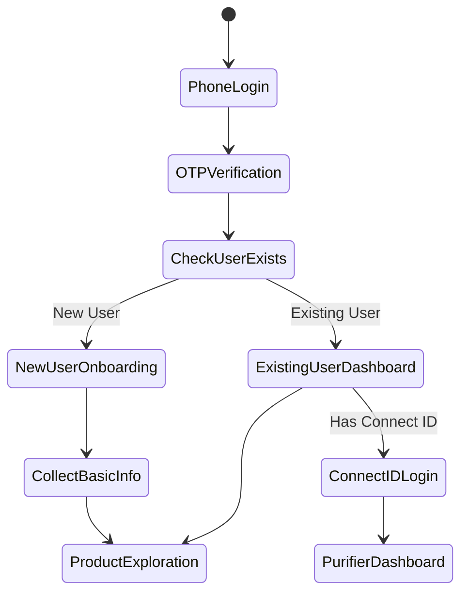
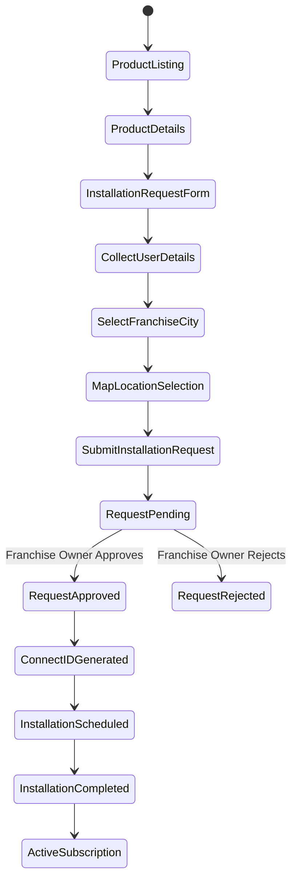
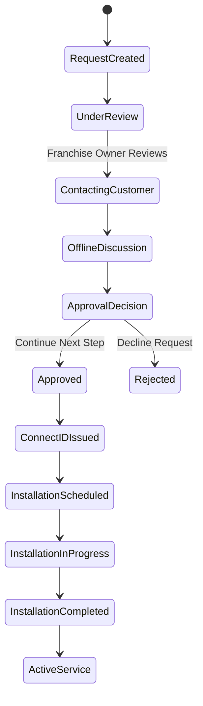
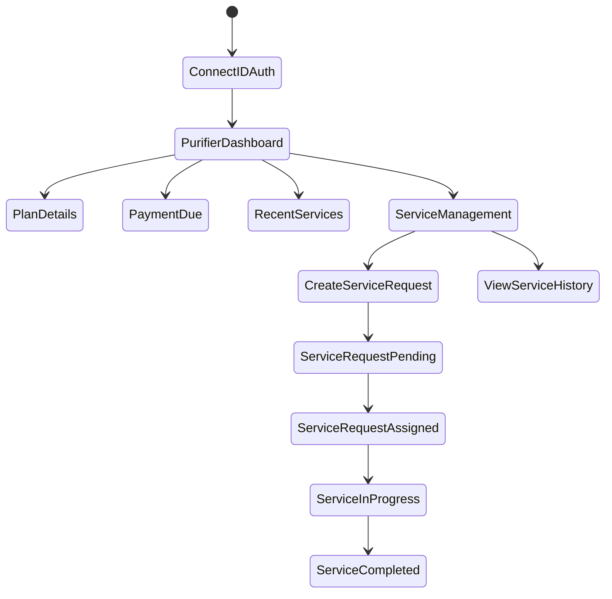
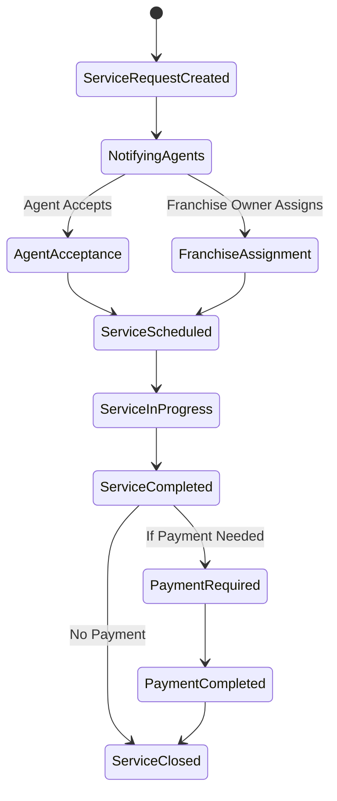
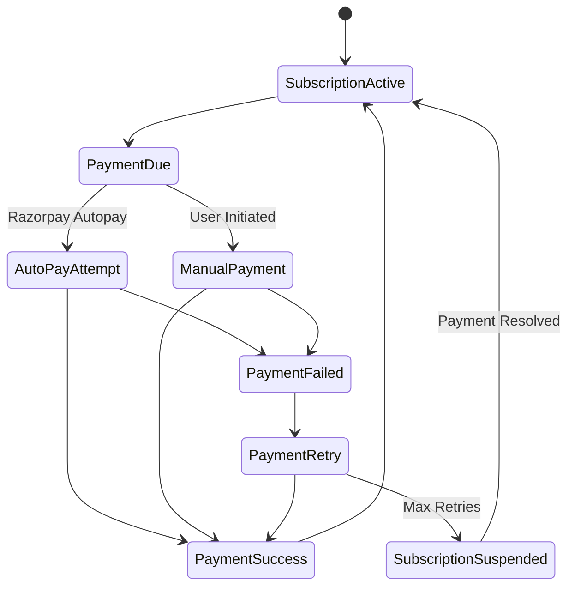
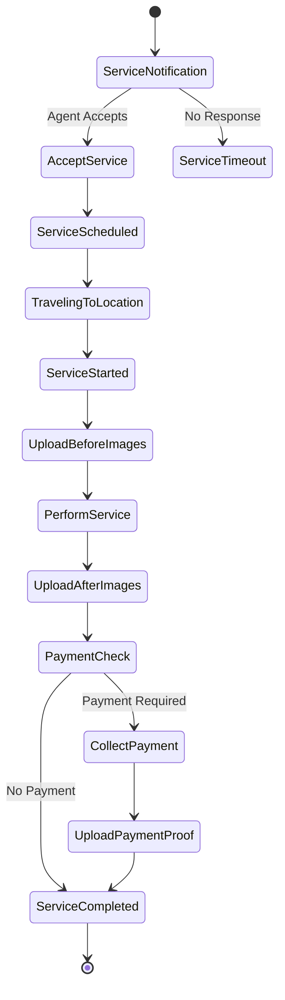

# PuriFiler State Machine Design

## 1. User Authentication & Onboarding States

## 2. Product Discovery & Installation Request States

## 3. Installation Request Management States

## 4. Purifier Dashboard States (Connect ID Access)

## 5. Service Request Lifecycle States

## 6. Payment & Subscription States

## 7. Agent Service Management States

## Implementation Strategy

### Database Schema Updates Needed:

1. **Connect ID System**
   - `purifier_connections` table
   - Connect ID generation and validation

2. **Enhanced Service Requests**
   - Before/after image storage
   - Payment proof uploads
   - Service completion workflow

3. **Installation Requests**
   - Separate from orders
   - Approval workflow
   - Location mapping

4. **Subscription Management**
   - Razorpay autopay integration
   - Payment scheduling
   - Subscription lifecycle

### API Endpoints to Add/Modify:

1. **Installation Requests**
   - `POST /api/installation-requests`
   - `GET /api/installation-requests/my-requests`
   - `PATCH /api/installation-requests/:id/approve`

2. **Connect ID System**
   - `POST /api/auth/connect-login`
   - `GET /api/purifier-dashboard/:connectId`

3. **Enhanced Service Management**
   - Image upload endpoints
   - Payment proof handling
   - Service completion workflow

4. **Subscription Management**
   - Autopay setup
   - Payment scheduling
   - Subscription status management