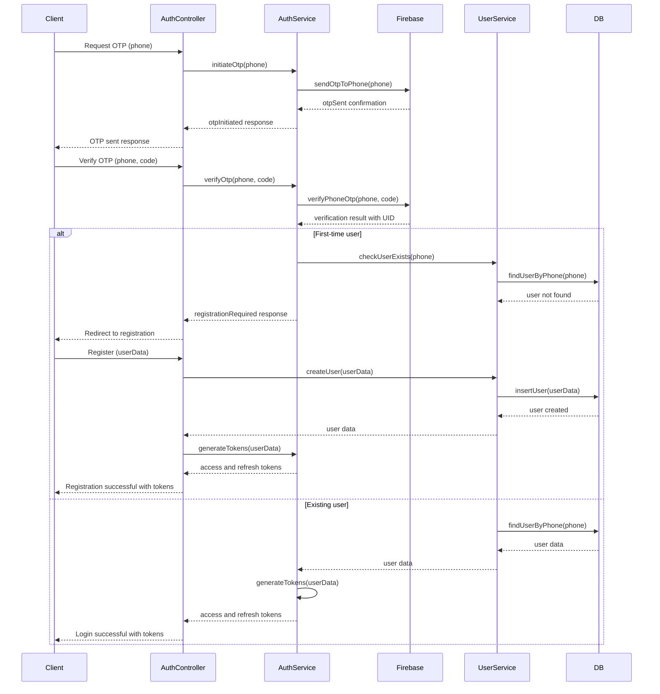
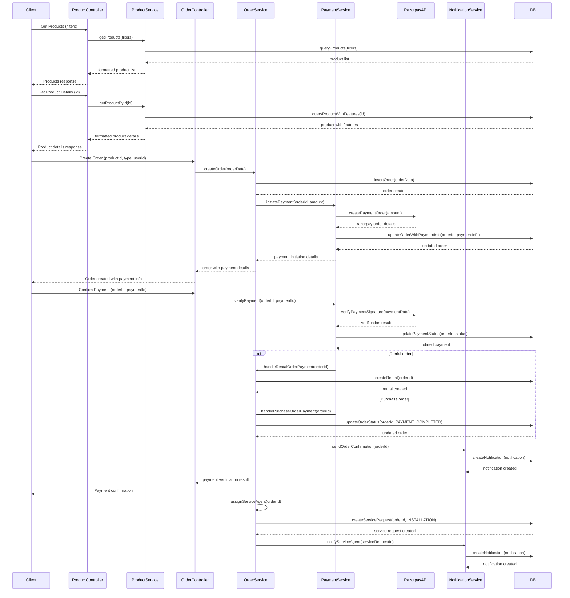
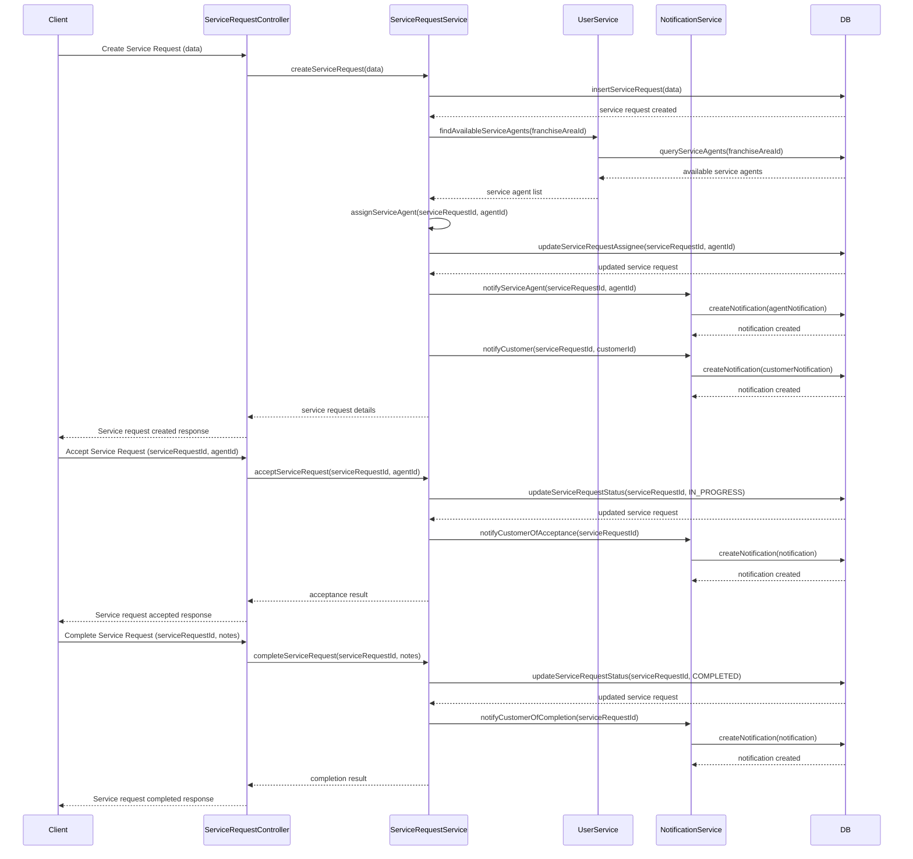
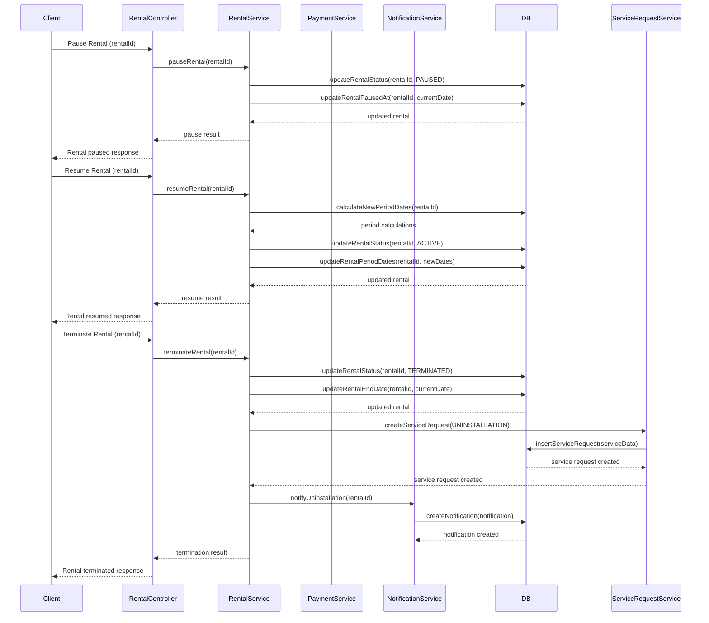
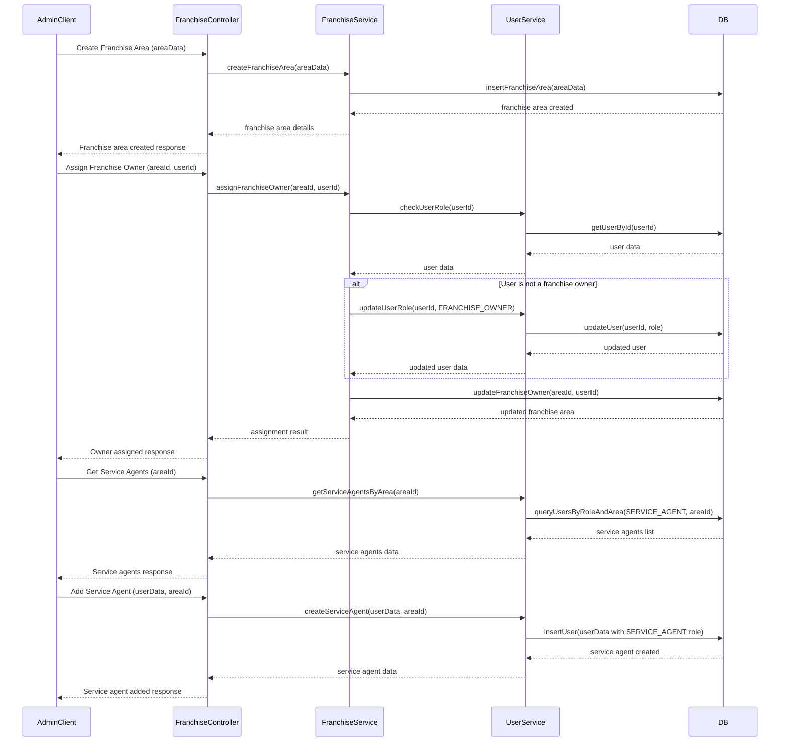

# PuriFiler System Design

## Implementation approach

Based on the PRD requirements, we'll build a robust backend system using Fastify as the framework with Turso DB as the database. The system will handle multiple stakeholders (customers, admins, franchise owners, and service agents) with different access levels through role-based access control.

### Key Technical Components:

1. **Backend Framework**: Fastify (with TypeScript)
2. **Database**: Turso DB with Drizzle ORM
3. **Authentication**: Firebase for phone OTP verification
4. **File Storage**: AWS S3 for product images
5. **Payment Processing**: Razorpay integration
6. **Notification System**: Email, SMS, WhatsApp, and Push Notifications
7. **API Documentation**: Swagger integration
8. **Validation**: Zod for schema validation

### Project Structure:

```
/purifiler-backend
  /src
    /controllers       # Request handlers
    /models            # Database schema definitions
    /services          # Business logic
    /routes            # Route definitions with Zod schemas
    /schemas           # Zod schema definitions
    /middlewares       # Custom middleware functions
    /utils             # Utility functions
    /config            # Configuration files
    /plugins           # Fastify plugins
    /types             # TypeScript type definitions
    app.ts             # Main application file
    server.ts          # Server initialization
  /migrations         # Database migrations
  /test               # Test files
  package.json
  tsconfig.json
  .env.example
```

### Core Functionality Implementation:

1. **User Authentication and Management**:
   - Firebase integration for phone OTP authentication
   - User registration and profile management
   - Role-based access control (RBAC)

2. **Franchise and Service Area Management**:
   - Geographic polygon mapping for defining service areas
   - Franchise owner assignment and management
   - Mapping users to appropriate service areas

3. **Product Catalog Management**:
   - Product CRUD operations with image handling via S3
   - Product categorization and filtering capabilities
   - Pricing models for both rental and purchase options

4. **Order Processing**:
   - Handling both rental and purchase workflows
   - Integration with Razorpay for payment processing
   - Order status tracking and management

5. **Service Request Management**:
   - Creation and tracking of service requests
   - Assignment to appropriate service agents
   - Status updates and notifications

6. **Notification System**:
   - Multi-channel notification delivery (Email, SMS, WhatsApp, Push)
   - Template-based message generation
   - Scheduled and triggered notifications

### Difficult Points and Solutions:

1. **Geographic Service Area Management**:
   - We'll use GeoJSON for storing polygon data defining service areas
   - Implement point-in-polygon algorithms to determine which service area a customer belongs to

2. **Complex Rental Management**:
   - Design a flexible subscription model that supports pause/resume functionality
   - Implement recurring payment handling for rentals
   - Track rental lifecycle including installation, maintenance, and potential return

3. **Multi-stakeholder Notifications**:
   - Create a unified notification service that supports multiple channels
   - Implement appropriate notification targeting based on user roles and actions
   - Ensure delivery tracking and retry mechanisms

4. **Service Assignment Logic**:
   - Develop an intelligent assignment algorithm considering agent workload, proximity, and skills
   - Implement acceptance/rejection flows for service agents
   - Handle edge cases like reassignment and escalation

5. **Role-Based Access Control**:
   - Implement a granular permission system beyond basic roles
   - Ensure proper access control at both API and service levels
   - Handle franchise-specific access restrictions

## Data structures and interfaces

The database schema will be implemented using Drizzle ORM with Turso DB. Below is the class diagram representing the core entities and their relationships:

```mermaid
classDiagram
    class User {
        +id: string
        +phone: string
        +name: string
        +email: string
        +address: string
        +alternativePhone: string
        +role: UserRole
        +location: GeoLocation
        +franchiseAreaId: string
        +createdAt: Date
        +updatedAt: Date
        +isActive: boolean
    }

    class UserRole {
        <<enum>>
        CUSTOMER
        ADMIN
        FRANCHISE_OWNER
        SERVICE_AGENT
    }

    class GeoLocation {
        +latitude: number
        +longitude: number
    }

    class FranchiseArea {
        +id: string
        +name: string
        +description: string
        +geoPolygon: GeoJSON
        +ownerId: string
        +isCompanyManaged: boolean
        +createdAt: Date
        +updatedAt: Date
        +isActive: boolean
    }

    class Product {
        +id: string
        +name: string
        +description: string
        +images: string[]
        +rentPrice: number
        +buyPrice: number
        +deposit: number
        +isRentable: boolean
        +isPurchasable: boolean
        +createdAt: Date
        +updatedAt: Date
        +isActive: boolean
    }

    class ProductFeature {
        +id: string
        +productId: string
        +name: string
        +value: string
        +createdAt: Date
        +updatedAt: Date
    }

    class Order {
        +id: string
        +customerId: string
        +productId: string
        +type: OrderType
        +status: OrderStatus
        +totalAmount: number
        +paymentStatus: PaymentStatus
        +serviceAgentId: string
        +installationDate: Date
        +createdAt: Date
        +updatedAt: Date
    }

    class OrderType {
        <<enum>>
        PURCHASE
        RENTAL
    }

    class OrderStatus {
        <<enum>>
        CREATED
        PAYMENT_PENDING
        PAYMENT_COMPLETED
        ASSIGNED
        INSTALLATION_PENDING
        INSTALLED
        CANCELLED
        COMPLETED
    }

    class PaymentStatus {
        <<enum>>
        PENDING
        COMPLETED
        FAILED
        REFUNDED
    }

    class Payment {
        +id: string
        +orderId: string
        +amount: number
        +type: PaymentType
        +status: PaymentStatus
        +razorpayPaymentId: string
        +razorpayOrderId: string
        +createdAt: Date
        +updatedAt: Date
    }

    class PaymentType {
        <<enum>>
        DEPOSIT
        PURCHASE
        RENTAL
        REFUND
    }

    class Rental {
        +id: string
        +orderId: string
        +customerId: string
        +productId: string
        +status: RentalStatus
        +startDate: Date
        +pausedAt: Date
        +endDate: Date
        +currentPeriodStartDate: Date
        +currentPeriodEndDate: Date
        +monthlyAmount: number
        +depositAmount: number
        +createdAt: Date
        +updatedAt: Date
    }

    class RentalStatus {
        <<enum>>
        ACTIVE
        PAUSED
        TERMINATED
        EXPIRED
    }

    class ServiceRequest {
        +id: string
        +customerId: string
        +productId: string
        +orderId: string
        +type: ServiceRequestType
        +description: string
        +status: ServiceRequestStatus
        +assignedToId: string
        +franchiseAreaId: string
        +scheduledDate: Date
        +completedDate: Date
        +createdAt: Date
        +updatedAt: Date
    }

    class ServiceRequestType {
        <<enum>>
        INSTALLATION
        REPAIR
        MAINTENANCE
        UNINSTALLATION
        OTHER
    }

    class ServiceRequestStatus {
        <<enum>>
        CREATED
        ASSIGNED
        IN_PROGRESS
        COMPLETED
        CANCELLED
    }

    class Notification {
        +id: string
        +userId: string
        +title: string
        +message: string
        +type: NotificationType
        +referenceId: string
        +referenceType: string
        +channels: NotificationChannel[]
        +status: NotificationStatus
        +createdAt: Date
        +updatedAt: Date
        +scheduledAt: Date
    }

    class NotificationType {
        <<enum>>
        ORDER_CONFIRMATION
        PAYMENT_SUCCESS
        PAYMENT_FAILURE
        SERVICE_REQUEST
        ASSIGNMENT_NOTIFICATION
        STATUS_UPDATE
        RENTAL_REMINDER
    }

    class NotificationChannel {
        <<enum>>
        EMAIL
        SMS
        PUSH
        WHATSAPP
    }

    class NotificationStatus {
        <<enum>>
        PENDING
        SENT
        FAILED
        READ
    }

    User "1" -- "*" Order: places
    User "1" -- "*" Rental: has
    User "1" -- "*" ServiceRequest: creates
    User "1" -- "*" ServiceRequest: assigned to
    User "1" -- "*" Notification: receives
    User "*" -- "1" FranchiseArea: belongs to
    User "1" -- "*" FranchiseArea: owns

    Product "1" -- "*" ProductFeature: has
    Product "1" -- "*" Order: ordered in
    Product "1" -- "*" Rental: rented in
    Product "1" -- "*" ServiceRequest: serviced in

    Order "1" -- "*" Payment: has
    Order "1" -- "1" Rental: creates

    FranchiseArea "1" -- "*" ServiceRequest: handles
```



## Program call flow

The sequence diagrams below illustrate the key flows in the PuriFiler system:

### User Authentication Flow



### Product Browsing and Ordering Flow



### Service Request Flow



### Rental Management Flow



### Franchise Area Management Flow



## Anything UNCLEAR

1. **Payment Scheduling for Rentals**: The PRD doesn't specify how recurring payments for rentals would be handled. Would the system automatically charge customers monthly, or would it send payment reminders? We've designed for both scenarios but would need clarification for the final implementation.

2. **Multiple Franchise Area Handling**: It's unclear if a user (especially service agents) can belong to multiple franchise areas. The current design assumes a user belongs to only one franchise area, but this could be extended if needed.

3. **Service Level Agreements (SLAs)**: The PRD doesn't specify specific SLAs for service request resolution times. This would be important for implementing proper notification and escalation workflows.

4. **Inventory Management**: While the PRD focuses on the rental and service management aspects, it doesn't detail if there should be inventory tracking for purifier units. We've designed the system to track products at a catalog level, but physical inventory tracking would require additional components.

5. **Offline Functionality**: For service agents who might work in areas with limited connectivity, the PRD doesn't specify if offline functionality is required. If needed, this would involve additional complexity in the mobile app design.

6. **Data Analytics Requirements**: While basic reporting is mentioned, specific analytics or business intelligence requirements are not detailed. The system could be extended with analytics capabilities if needed.